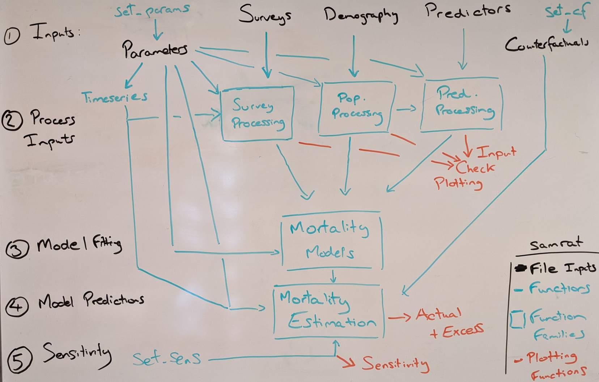

```{r, include = FALSE}
knitr::opts_chunk$set(
  collapse = TRUE,
  comment = "#>"
)
```

This is an overall structure of the `samrat` package, which details how the 
different analysis elements (parameters, analysis, plotting etc) are functionally
related. 

The package structure is shown below:




```{r setup}
library(samrat)
```
